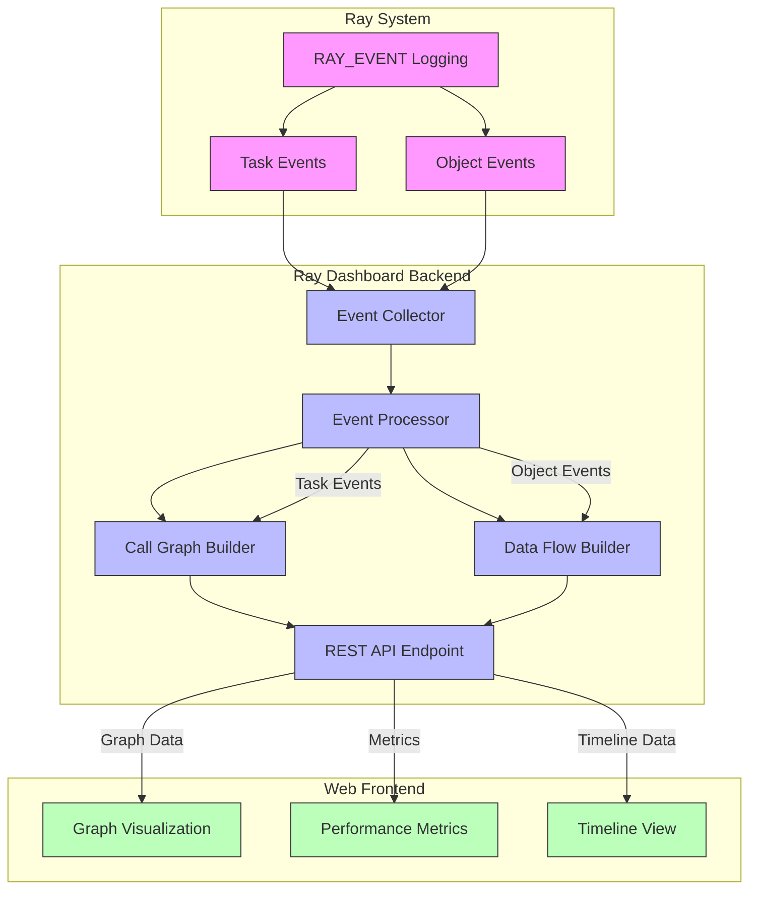

# Ray Flow Insight 设计方案

## 项目背景与目标

Ray Flow Insight 是一个用于可视化和分析Ray分布式系统中任务调用关系和数据流动的工具。本设计方案描述了如何利用Ray的事件记录机制（RAY_EVENT）来跟踪系统中的调用流和对象流，并将这些信息组织成直观的可视化图表，帮助开发者理解系统行为、诊断性能瓶颈和优化应用程序。

### 设计目标

- 实时跟踪Ray系统中的任务调用关系
- 监控系统中的数据流动和对象传递
- 计算任务间数据传输的吞吐量
- 提供直观的可视化界面展示系统行为
- 最小化对系统性能的影响

## 系统架构

Ray Flow Insight由以下几个主要组件构成：

1. **事件收集器**：在Ray核心组件中添加事件记录点，收集任务和对象相关事件
2. **可视化界面**：展示生成的图形和相关统计信息



## 技术实现

### 事件记录机制

Ray提供了RAY_EVENT宏来记录事件，其基本用法如下：

```cpp
RAY_EVENT(INFO, "event_label") << "event message";
```

事件可以附加自定义字段：

```cpp
RAY_EVENT(INFO, "event_label")
  .WithField("field_name", field_value)
  << "event message";
```

### 关键事件点

Ray Flow Insight需要在以下关键点记录事件：

1. **任务提交事件**：在SubmitTask调用时记录，包含任务的详细信息
2. **对象传递事件**：**TODO**

这两种事件类型提供了构建完整调用图和数据流图所需的全部信息

## 详细设计

### 事件收集

#### 任务调用流记录

在各种任务提交方法中添加事件记录，包括`NormalTaskSubmitter::SubmitTask`、`ActorTaskSubmitter::SubmitTask`等：

```cpp
// 在NormalTaskSubmitter::SubmitTask中添加（仅处理普通任务）
Status NormalTaskSubmitter::SubmitTask(TaskSpecification task_spec) {
  RAY_CHECK(task_spec.IsNormalTask());
  
  TaskID task_id = task_spec.TaskId();
  // 使用当前任务ID作为父任务ID
  TaskID parent_task_id = worker_context_.GetCurrentTaskID();
  
  // 记录任务提交事件
  RAY_EVENT(INFO, "task_submitted")
    .WithField("task_id", task_id.Hex())
    .WithField("task_type", "NORMAL_TASK")
    .WithField("src_task_id", parent_task_id.Hex())
    .WithField("target_task_id", task_id.Hex())
    .WithField("src_actor_id", "")  // 普通任务没有源Actor
    .WithField("target_actor_id", "")  // 普通任务没有目标Actor
    .WithField("job_id", task_spec.JobId().Hex())
    .WithField("timestamp_ms", current_time_ms())
    .WithField("descriptor", task_spec.FunctionDescriptor().ToString())
    .WithField("language", LanguageString(task_spec.GetLanguage()))
    << "Task submitted";
  
  // 原有的提交逻辑
  num_tasks_submitted_++;
  // ...
  
  return Status::OK();
}

// 在ActorTaskSubmitter::SubmitTask中添加（处理Actor任务）
Status ActorTaskSubmitter::SubmitTask(TaskSpecification task_spec) {
  RAY_CHECK(task_spec.IsActorTask());
  
  TaskID task_id = task_spec.TaskId();
  // 使用当前任务ID作为父任务ID
  TaskID parent_task_id = worker_context_.GetCurrentTaskID();
  ActorID actor_id = task_spec.ActorId();
  
  // 获取源Actor ID
  ActorID src_actor_id = worker_context_.GetCurrentActorID();
  
  // 记录任务提交事件
  RAY_EVENT(INFO, "task_submitted")
    .WithField("task_id", task_id.Hex())
    .WithField("task_type", "ACTOR_TASK")
    .WithField("src_task_id", parent_task_id.Hex())
    .WithField("target_task_id", task_id.Hex())
    .WithField("src_actor_id", src_actor_id.Hex())
    .WithField("target_actor_id", actor_id.Hex())
    .WithField("job_id", task_spec.JobId().Hex())
    .WithField("timestamp_ms", current_time_ms())
    .WithField("descriptor", task_spec.FunctionDescriptor().ToString())
    .WithField("language", LanguageString(task_spec.GetLanguage()))
    << "Actor task submitted";
  
  // 原有的提交逻辑
  // ...
  
  return Status::OK();
}

// 在ActorCreationTaskSubmitter::SubmitTask中添加（处理Actor创建任务）
Status ActorCreationTaskSubmitter::SubmitTask(TaskSpecification task_spec) {
  RAY_CHECK(task_spec.IsActorCreationTask());
  
  TaskID task_id = task_spec.TaskId();
  // 使用当前任务ID作为父任务ID
  TaskID parent_task_id = worker_context_.GetCurrentTaskID();
  ActorID actor_id = task_spec.ActorCreationId();
  
  // 获取源Actor ID
  ActorID src_actor_id = worker_context_.GetCurrentActorID();
  
  // 记录任务提交事件
  RAY_EVENT(INFO, "task_submitted")
    .WithField("task_id", task_id.Hex())
    .WithField("task_type", "ACTOR_CREATION_TASK")
    .WithField("src_task_id", parent_task_id.Hex())
    .WithField("target_task_id", task_id.Hex())
    .WithField("src_actor_id", src_actor_id.Hex())
    .WithField("target_actor_id", actor_id.Hex())
    .WithField("job_id", task_spec.JobId().Hex())
    .WithField("timestamp_ms", current_time_ms())
    .WithField("descriptor", task_spec.FunctionDescriptor().ToString())
    .WithField("language", LanguageString(task_spec.GetLanguage()))
    << "Actor creation task submitted";
  
  // 原有的提交逻辑
  // ...
  
  return Status::OK();
}
```

#### 对象流记录

**TODO**

#### Dashboard处理

Dashboard会将处理后的数据转换为可视化所需的数据结构，并通过Web界面展示给用户。

### 数据结构设计

Ray Flow Insight将事件记录处理并转换为以下数据结构，用于可视化：

```javascript
/**
 * Graph data for Ray Actor and Function Call Graph visualization
 */
export const graphData = {
  // Actor节点信息
  actors: [
    { id: 'actor1', name: 'LLMRayActor', language: 'python' },
    { id: 'actor2', name: 'ActorModelRayActor', language: 'python' },
    // ...其他Actor
  ],
  
  // Actor方法信息
  methods: [
    { id: 'method1', actorId: 'actor1', name: '__init__', language: 'python' },
    { id: 'method2', actorId: 'actor2', name: '__init__', language: 'python' },
    // ...其他方法
  ],
  
  // 普通函数信息
  functions: [
    { id: 'main', name: 'main', language: 'python' },
    // ...其他函数
  ],
  
  // 调用流信息
  callFlows: [
    { source: 'main', target: 'method1', count: 1 },
    { source: 'main', target: 'method2', count: 1 },
    // ...其他调用关系
  ],
  
  // 数据流信息
  dataFlows: [
    { source: 'method11', target: 'method10', speed: '10MB/s' },
    { source: 'method12', target: 'method10', speed: '5MB/s' },
    // ...其他数据流
  ]
};
```

### 可视化界面

Ray Flow Insight将提供以下可视化功能：

1. **调用图**：展示任务和Actor之间的调用关系
2. **数据流图**：展示对象在任务之间的流动
3. **性能指标**：展示任务执行时间、数据传输吞吐量等指标
4. **时间轴**：展示系统随时间变化的行为

## 附录

### Function Descriptor 结构

Ray 支持多种语言（Python、Java、C++），每种语言都有自己的Function Descriptor 格式。Function Descriptor 是识别和调用函数的关键信息，也是构建调用图的重要数据源。

#### Python Function Descriptor

Python Function Descriptor 包含以下字段：
```
PythonFunctionDescriptor(module_name, class_name, function_name, function_hash)
```

- `module_name`: 模块名称
- `class_name`: 类名（如果是类方法）
- `function_name`: 函数名
- `function_hash`: 函数哈希值（用于版本控制）

示例：`ray.worker.main`（普通函数）或 `ray.actor.Actor.method`（Actor方法）

Python Function Descriptor 在 Ray 中的定义：

```python
# python/ray/includes/function_descriptor.pxd
cdef class PythonFunctionDescriptor:
    cdef:
        public str module_name
        public str class_name
        public str function_name
        public str function_hash
        public str repr
        public str function_id
```

#### Java Function Descriptor

Java Function Descriptor 包含以下字段：
```
JavaFunctionDescriptor(class_name, function_name, signature)
```

- `class_name`: 完全限定的类名
- `function_name`: 方法名
- `signature`: 方法签名

示例：`io.ray.test.TestActor.method`

Java Function Descriptor 在 Ray 中的定义：

```java
// java/runtime/src/main/java/io/ray/runtime/functionmanager/JavaFunctionDescriptor.java
public class JavaFunctionDescriptor implements FunctionDescriptor {

  public String className;
  public String functionName;
  public String signature;

  public JavaFunctionDescriptor(String className, String functionName, String signature) {
    this.className = className;
    this.functionName = functionName;
    this.signature = signature;
  }
  
  @Override
  public List<String> toList() {
    return Arrays.asList(className, functionName, signature);
  }
  
  @Override
  public Language getLanguage() {
    return Language.JAVA;
  }
}
```

#### C++ Function Descriptor

C++ Function Descriptor 包含以下字段：
```
CppFunctionDescriptor(function_name, caller, class_name)
```

- `function_name`: 函数名
- `caller`: 调用者标识
- `class_name`: 类名（如果是类方法）

示例：`Counter::Plus1`

C++ Function Descriptor 在 Ray 中的定义：

```cpp
// src/ray/common/function_descriptor.h
class CppFunctionDescriptor : public FunctionDescriptorInterface {
 public:
  CppFunctionDescriptor(const std::string &function_name, const std::string &caller,
                        const std::string &class_name)
      : function_name_(function_name), caller_(caller), class_name_(class_name) {}

  std::string ToString() const override {
    if (!class_name_.empty()) {
      return class_name_ + "::" + function_name_;
    }
    return function_name_;
  }

  size_t Hash() const override {
    // ... hash implementation ...
  }

  std::vector<std::string> ToList() const override {
    return {function_name_, caller_, class_name_};
  }

 private:
  std::string function_name_;
  std::string caller_;
  std::string class_name_;
};
```

#### Function Descriptor 解析

在处理事件时，需要正确解析Function Descriptor以提取语言特定的信息。以下是一个更完善的Function Descriptor 解析实现：

```python
def parse_function_descriptor(self, descriptor: str, language: str) -> Dict[str, str]:
    """
    解析函数描述符，提取类名、方法名、模块名等信息
    
    Args:
        descriptor: 函数描述符字符串
        language: 语言类型 ("python", "java", "cpp")
        
    Returns:
        包含解析结果的字典
    """
    if language == "python":
        # Python 函数描述符格式: module_name.class_name.function_name
        parts = descriptor.split('.')
        if len(parts) >= 3:
            # 可能是 Actor 方法
            if parts[-1] == '__init__':
                # Actor 构造函数
                return {
                    "type": "actor_constructor",
                    "module": '.'.join(parts[:-2]),
                    "class_name": parts[-2],
                    "method_name": "__init__"
                }
            else:
                # Actor 方法
                return {
                    "type": "actor_method",
                    "module": '.'.join(parts[:-2]),
                    "class_name": parts[-2],
                    "method_name": parts[-1]
                }
        else:
            # 普通函数
            return {
                "type": "function",
                "module": '.'.join(parts[:-1]) if len(parts) > 1 else "",
                "function_name": parts[-1]
            }
    elif language == "java":
        # Java 函数描述符格式: package.ClassName.methodName
        parts = descriptor.split('.')
        if len(parts) >= 2:
            class_name = '.'.join(parts[:-1])
            method_name = parts[-1]
            return {
                "type": "actor_method" if method_name != "<init>" else "actor_constructor",
                "class_name": class_name,
                "method_name": method_name,
                "module": ""  # Java 没有模块概念
            }
        else:
            return {
                "type": "function",
                "function_name": descriptor,
                "module": ""
            }
    elif language == "cpp":
        # C++ 函数描述符格式: ClassName::FunctionName 或 FunctionName
        if "::" in descriptor:
            parts = descriptor.split('::')
            return {
                "type": "actor_method",
                "class_name": parts[0],
                "method_name": parts[1],
                "module": ""
            }
        else:
            return {
                "type": "function",
                "function_name": descriptor,
                "module": ""
            }
    else:
        # 未知语言，返回基本信息
        return {
            "type": "unknown",
            "function_name": descriptor,
            "module": ""
        }
```


## 实现计划

Ray Flow Insight的实现将分为以下几个阶段：

1. **阶段一**：实现调用流记录：在Ray核心组件中添加事件记录点
   - 在SubmitTask方法中添加任务提交事件记录

2. **阶段二**：数据收集和处理
   - 开发调用图生成算法

3. **阶段三**：开发可视化界面
   - 实现图形展示功能
   - 实现交互功能

4. **阶段四**：数据集成
   - 将数据集成到dashboard中


## 使用事件构建调用图

根据Ray系统事件数据，我们可以构建完整的调用图，而无需额外记录任务创建事件或对象创建事件。这种方法利用了Ray系统中已有的事件记录机制，减少了对系统的侵入性。

### 事件到图形数据的转换

Ray Flow Insight通过处理任务事件和对象事件来构建完整的调用图和数据流图。下面详细说明如何从这些事件构造`graphData`数据结构：

#### 事件数据结构

1. **任务提交事件 (task_submitted)**:
```cpp
RAY_EVENT(INFO, "task_submitted")
  .WithField("task_id", task_id.Hex())
  .WithField("task_type", "NORMAL_TASK")  // 或 "ACTOR_TASK", "ACTOR_CREATION_TASK"
  .WithField("src_task_id", parent_task_id.Hex())
  .WithField("target_task_id", task_id.Hex())
  .WithField("src_actor_id", src_actor_id.Hex())  // 如果适用
  .WithField("target_actor_id", actor_id.Hex())   // 如果适用
  .WithField("job_id", task_spec.JobId().Hex())
  .WithField("timestamp_ms", current_time_ms())
  .WithField("descriptor", task_spec.FunctionDescriptor().ToString())
  .WithField("language", LanguageString(task_spec.GetLanguage()))  // 添加语言信息
  << "Task submitted";
```

2. **Object引用事件**:

**TODO**


#### 构建调用图和数据流图的Python实现

Dashboard使用Python代码处理事件并构建调用图和数据流图。以下是实现示例：

```python
from collections import defaultdict
from datetime import datetime
from typing import Dict, List, Any, Tuple

class CallGraphBuilder:
    def __init__(self):
        # 存储Actor和函数节点
        self.actors = {}  # actor_id -> actor_info
        self.methods = {}  # method_id -> method_info
        self.functions = {}  # function_id -> function_info
        
        # 存储调用关系
        self.call_flows = defaultdict(lambda: {"count": 0})
        
        # 存储对象创建和引用信息
        self.object_creations = {}  # object_id -> creation_info
        self.object_references = []  # list of reference_info
        
        # 存储数据流关系
        self.data_flows = defaultdict(lambda: {"count": 0, "total_bytes": 0, "total_throughput": 0})
        
        # 任务ID到节点ID的映射
        self.task_to_node_map = {}  # task_id -> node_id
    
    def parse_function_descriptor(self, descriptor: str, language: str) -> Dict[str, str]:
        """
        解析函数描述符，提取类名、方法名、模块名等信息
        
        Args:
            descriptor: 函数描述符字符串
            language: 语言类型 ("python", "java", "cpp")
            
        Returns:
            包含解析结果的字典
        """
        if language == "python":
            # Python 函数描述符格式: module_name.class_name.function_name
            parts = descriptor.split('.')
            if len(parts) >= 3:
                # 可能是 Actor 方法
                if parts[-1] == '__init__':
                    # Actor 构造函数
                    return {
                        "type": "actor_constructor",
                        "module": '.'.join(parts[:-2]),
                        "class_name": parts[-2],
                        "method_name": "__init__"
                    }
                else:
                    # Actor 方法
                    return {
                        "type": "actor_method",
                        "module": '.'.join(parts[:-2]),
                        "class_name": parts[-2],
                        "method_name": parts[-1]
                    }
            else:
                # 普通函数
                return {
                    "type": "function",
                    "module": '.'.join(parts[:-1]) if len(parts) > 1 else "",
                    "function_name": parts[-1]
                }
        elif language == "java":
            # Java 函数描述符格式: package.ClassName.methodName
            parts = descriptor.split('.')
            if len(parts) >= 2:
                class_name = '.'.join(parts[:-1])
                method_name = parts[-1]
                return {
                    "type": "actor_method" if method_name != "<init>" else "actor_constructor",
                    "class_name": class_name,
                    "method_name": method_name,
                    "module": ""  # Java 没有模块概念
                }
            else:
                return {
                    "type": "function",
                    "function_name": descriptor,
                    "module": ""
                }
        elif language == "cpp":
            # C++ 函数描述符格式: ClassName::FunctionName 或 FunctionName
            if "::" in descriptor:
                parts = descriptor.split('::')
                return {
                    "type": "actor_method",
                    "class_name": parts[0],
                    "method_name": parts[1],
                    "module": ""
                }
            else:
                return {
                    "type": "function",
                    "function_name": descriptor,
                    "module": ""
                }
        else:
            # 未知语言，返回基本信息
            return {
                "type": "unknown",
                "function_name": descriptor,
                "module": ""
            }
    
    def process_task_submitted(self, event: Dict[str, Any]) -> None:
        """处理任务提交事件，构建Actor、函数节点和调用关系"""
        task_id = event["task_id"]
        task_type = event["task_type"]
        src_task_id = event["src_task_id"]
        descriptor = event["descriptor"]
        language = event.get("language", "python").lower()
        
        # 获取实际的Actor ID（而不是使用生成的ID）
        target_actor_id = event.get("target_actor_id", "")
        
        # 解析函数描述符
        func_info = self.parse_function_descriptor(descriptor, language)
        
        # 生成节点ID
        node_id = self.generate_node_id(func_info, task_type, target_actor_id)
        
        # 存储任务ID到节点ID的映射
        self.task_to_node_map[task_id] = node_id
        
        # 如果节点不存在，则创建新节点
        if node_id not in self.nodes:
            self.create_node(node_id, func_info, task_type, language, target_actor_id)
        
        # 更新节点的调用次数
        self.nodes[node_id]["call_count"] += 1
        
        # 构建调用关系
        if src_task_id in self.task_to_node_map:
            source_node_id = self.task_to_node_map[src_task_id]
            target_node_id = node_id
            
            if source_node_id and target_node_id:
                flow_key = f"{source_node_id}->{target_node_id}"
                if flow_key not in self.call_flows:
                    self.call_flows[flow_key] = {
                        "source": source_node_id,
                        "target": target_node_id,
                        "count": 0
                    }
                self.call_flows[flow_key]["count"] += 1
    
    def generate_node_id(self, func_info: Dict[str, str], task_type: str, actor_id: str = "") -> str:
        """
        根据函数信息和任务类型生成节点ID
        
        Args:
            func_info: 解析后的函数描述符信息
            task_type: 任务类型
            actor_id: 实际的Actor ID（对于Actor任务）
            
        Returns:
            节点ID
        """
        if task_type == "ACTOR_CREATION_TASK":
            # Actor创建任务，使用实际的Actor ID
            return actor_id
        elif task_type == "ACTOR_TASK":
            # Actor方法任务，使用实际的Actor ID和方法名，确保方法绑定到特定Actor实例
            return f"{actor_id}.{func_info['method_name']}"
        else:
            # 普通函数任务，使用任务名称（而非任务ID）
            return f"{func_info['module']}.{func_info['function_name']}"
    
    def create_node(self, node_id: str, func_info: Dict[str, str], task_type: str, language: str, actor_id: str = "") -> None:
        """
        创建节点
        
        Args:
            node_id: 节点ID
            func_info: 解析后的函数描述符信息
            task_type: 任务类型
            language: 语言类型
            actor_id: 实际的Actor ID（对于Actor任务）
        """
        if task_type == "ACTOR_CREATION_TASK":
            # 创建Actor节点，使用实际的Actor ID
            self.nodes[node_id] = {
                "id": node_id,  # 使用实际的Actor ID
                "type": "actor",
                "name": func_info["class_name"],
                "module": func_info["module"],
                "language": language,
                "call_count": 0
            }
            
            # 同时创建Actor初始化方法节点，绑定到特定Actor实例
            init_method_id = f"{node_id}.__init__"
            self.nodes[init_method_id] = {
                "id": init_method_id,
                "type": "method",
                "actor_id": node_id,  # 使用实际的Actor ID
                "name": "__init__",
                "class_name": func_info["class_name"],
                "module": func_info["module"],
                "language": language,
                "call_count": 0
            }
        elif task_type == "ACTOR_TASK":
            # 创建Actor方法节点，绑定到特定Actor实例
            self.nodes[node_id] = {
                "id": node_id,
                "type": "method",
                "actor_id": actor_id,  # 使用实际的Actor ID
                "name": func_info["method_name"],
                "class_name": func_info["class_name"],
                "module": func_info["module"],
                "language": language,
                "call_count": 0
            }
        else:
            # 创建普通函数节点，使用任务名称
            self.nodes[node_id] = {
                "id": node_id,
                "type": "function",
                "name": func_info["function_name"],
                "module": func_info["module"],
                "language": language,
                "call_count": 0
            }
    
    def process_object(self, event: Dict[str, Any]) -> None:
        """处理参数对象引用事件"""
        # TODO
        pass
   
    def build_data_flows(self) -> None:
        """构建数据流关系"""
        # TODO
        pass

    def generate_graph_data(self) -> Dict[str, Any]:
        """生成最终的graphData结构"""
        # 提取Actor节点
        actors = [node for node_id, node in self.nodes.items() if node["type"] == "actor"]
        
        # 提取方法节点
        methods = [node for node_id, node in self.nodes.items() if node["type"] == "method"]
        
        # 提取函数节点
        functions = [node for node_id, node in self.nodes.items() if node["type"] == "function"]
        
        # 处理调用流关系
        call_flows = list(self.call_flows.values())
        
        # 处理数据流关系
        # TODO

        return {
            "actors": actors,
            "methods": methods,
            "functions": functions,
            "callFlows": call_flows,
            "dataFlows": None # TODO
        }

def build_call_graph(events: List[Dict[str, Any]]) -> Dict[str, Any]:
    """
    从事件列表构建调用图和数据流图
    
    Args:
        events: 事件列表，包含task_submitted, arg_object, return_object等事件
        
    Returns:
        包含actors, methods, functions, callFlows, dataFlows的字典
    """
    builder = CallGraphBuilder()
    
    # 按时间戳排序事件
    sorted_events = sorted(events, key=lambda e: e["timestamp_ms"])
    
    # 处理事件
    for event in sorted_events:
        event_type = event.get("event_type")
        
        if event_type == "task_submitted":
            builder.process_task_submitted(event)
        elif event_type == "object":
            builder.process_object(event)
    
    # 构建数据流关系
    builder.build_data_flows()
    
    # 生成最终的graphData结构
    return builder.generate_graph_data()

# 在Dashboard中使用示例
async def get_call_graph(self, req: aiohttp.web.Request) -> aiohttp.web.Response:
    """API端点，返回调用图数据"""
    # 获取所有事件
    all_events = []
    for job_id, events in self.events.items():
        for event_id, event in events.items():
            # 添加事件类型字段
            event_data = event.copy()
            event_data["event_type"] = event.get("label")
            all_events.append(event_data)
    
    # 构建调用图
    graph_data = build_call_graph(all_events)
    
    # 返回JSON响应
    return aiohttp.web.json_response(graph_data)
```

这个Python实现提供了一个完整的调用图和数据流图构建过程，包括：

1. 解析任务提交事件，构建Actor和函数节点
2. 构建任务之间的调用关系
3. 处理对象创建和引用事件，构建数据流关系 (TODO)
4. 计算数据传输吞吐量 (TODO)
5. 生成最终的图形数据结构

Dashboard可以通过API端点提供这些数据，供前端可视化使用。
